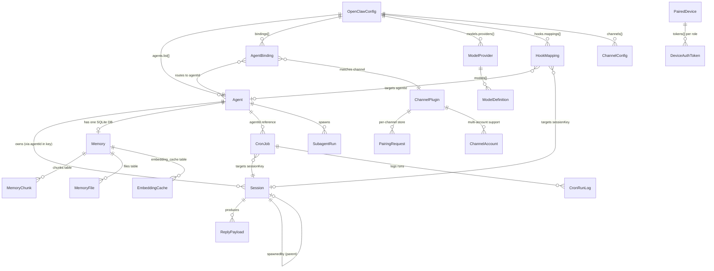

# 02 — Data Model

## 2.1 Entity Reference

### Agent

The central persona entity. Each agent is an AI identity with its own model config, tools, workspace, and behavioral settings.

**Source:** `src/config/types.agents.ts`

| Field | Type | Required | Notes |
|---|---|---|---|
| `id` | `string` | Yes | Unique identifier (default: `"main"`) |
| `default` | `boolean` | No | Marks the fallback agent for unmatched routes |
| `name` | `string` | No | Display name |
| `workspace` | `string` | No | Filesystem path to agent workspace |
| `agentDir` | `string` | No | Override for agent data directory |
| `model` | `string \| { primary, fallbacks[] }` | No | Model selection with optional fallback chain |
| `skills` | `string[]` | No | Omit = all skills; `[]` = none |
| `memorySearch` | `MemorySearchConfig` | No | Vector search settings (provider, model, hybrid params) |
| `humanDelay` | `HumanDelayConfig` | No | Simulated typing delay (`off` / `natural` / `custom`) |
| `heartbeat` | `HeartbeatConfig` | No | Per-agent override of heartbeat schedule and targets |
| `identity` | `IdentityConfig` | No | Name, theme, emoji, avatar |
| `groupChat` | `GroupChatConfig` | No | Mention patterns, history limit |
| `subagents` | `{ allowAgents[], model }` | No | Sub-agent spawning permissions |
| `sandbox` | `AgentSandboxConfig` | No | Docker sandbox settings |
| `tools` | `AgentToolsConfig` | No | Tool allow/deny lists, profiles, exec config |

**Key nested types:**

- **`AgentSandboxConfig`**: `mode` (`off` / `non-main` / `all`), `scope` (`session` / `agent` / `shared`), `workspaceAccess` (`none` / `ro` / `rw`), Docker settings, browser settings, prune settings.
- **`AgentToolsConfig`**: `profile` (`minimal` / `coding` / `messaging` / `full`), `allow[]`, `deny[]`, `byProvider` overrides, `elevated` (owner-only tools), `exec` (shell execution config), `fs` (filesystem tool config), `loopDetection`.
- **`IdentityConfig`**: `name`, `theme`, `emoji`, `avatar` (path, URL, or data URI).
- **`HumanDelayConfig`**: `mode` (`off` / `natural` / `custom`), `minMs` (default 800), `maxMs` (default 2500).

---

### Session (SessionEntry)

A conversation context between an agent and a sender (or group). Persisted as a JSON index entry with a corresponding JSONL transcript file.

**Source:** `src/config/sessions/types.ts`

| Field | Type | Required | Notes |
|---|---|---|---|
| `sessionId` | `string` | Yes | Unique identifier |
| `updatedAt` | `number` | Yes | Unix timestamp (ms) of last update |
| `sessionFile` | `string` | No | Path to JSONL transcript file |
| `spawnedBy` | `string` | No | Parent session key (for sub-agents) |
| `spawnDepth` | `number` | No | 0 = main, 1 = sub-agent, 2 = sub-sub-agent |
| `chatType` | `"direct" \| "group" \| "channel"` | No | Conversation type |
| `channel` | `string` | No | Origin channel ID |
| `label` | `string` | No | User-assigned label |
| `displayName` | `string` | No | Sender display name |
| `subject` | `string` | No | Conversation subject |
| `origin` | `SessionOrigin` | No | Full origin context (provider, surface, from, to) |
| `sendPolicy` | `"allow" \| "deny"` | No | Controls whether inbound messages are accepted |
| `queueMode` | `string` | No | Message queuing strategy (see below) |
| `modelOverride` | `string` | No | Per-session model override |
| `providerOverride` | `string` | No | Per-session provider override |
| `thinkingLevel` | `string` | No | Per-session thinking override |
| `compactionCount` | `number` | No | Times this session's context has been compacted |
| `inputTokens` | `number` | No | Cumulative input token count |
| `outputTokens` | `number` | No | Cumulative output token count |
| `totalTokens` | `number` | No | Cumulative total tokens |

**Queue modes:** `steer`, `followup`, `collect`, `steer-backlog`, `steer+backlog`, `queue`, `interrupt`

**Session key format:** `agent:<agentId>:<scope-segments>`

| DM Scope | Key Pattern |
|---|---|
| `main` | `agent:main:main` |
| `per-peer` | `agent:main:direct:<peerId>` |
| `per-channel-peer` | `agent:main:<channel>:direct:<peerId>` |
| `per-account-channel-peer` | `agent:main:<channel>:<accountId>:direct:<peerId>` |
| Group | `agent:main:<channel>:group:<groupId>` |
| Thread | `<base-key>:thread:<threadId>` |
| Sub-agent | `agent:main:subagent:<taskId>` |
| Cron | `agent:main:cron:<jobId>` |

**Storage:** Index file `sessions.json` (JSON map of key → entry). Transcripts at `~/.openclaw/agents/<agentId>/sessions/<sessionId>.jsonl`.

**Maintenance defaults:** prune entries older than 30 days, cap at 500 entries, rotate transcript files at 10 MB.

---

### Channel / ChannelPlugin

The contract every messaging platform integration must implement. Each channel is a plugin that handles inbound/outbound messaging, authentication, and platform-specific features.

**Source:** `src/channels/plugins/types.plugin.ts`

| Adapter Slot | Type | Purpose |
|---|---|---|
| `id` | `ChannelId` | Unique channel identifier (e.g. `"telegram"`) |
| `meta` | `ChannelMeta` | Display info: label, blurb, docs path, order, aliases |
| `capabilities` | `ChannelCapabilities` | Declares supported chat types and features |
| `config` | `ChannelConfigAdapter` | **Required.** Account resolution from config |
| `setup` | `ChannelSetupAdapter` | Channel connection lifecycle (start/stop listeners) |
| `pairing` | `ChannelPairingAdapter` | Sender pairing flow (code generation, approval) |
| `security` | `ChannelSecurityAdapter` | Access control (DM/group policy enforcement) |
| `groups` | `ChannelGroupAdapter` | Group management and allowlists |
| `outbound` | `ChannelOutboundAdapter` | Send messages, media, reactions to the platform |
| `streaming` | `ChannelStreamingAdapter` | Live-update messages during agent execution |
| `threading` | `ChannelThreadingAdapter` | Thread creation and message threading |
| `messaging` | `ChannelMessagingAdapter` | Message formatting, chunking, markdown transforms |
| `mentions` | `ChannelMentionAdapter` | @-mention detection and resolution |
| `status` | `ChannelStatusAdapter` | Connection health, probe, audit info |
| `gateway` | `ChannelGatewayAdapter` | Gateway-level HTTP route registration |
| `auth` | `ChannelAuthAdapter` | OAuth/credential management |
| `elevated` | `ChannelElevatedAdapter` | Owner-only elevated tool access |
| `commands` | `ChannelCommandAdapter` | Platform-native command registration |
| `agentPrompt` | `ChannelAgentPromptAdapter` | Channel-specific system prompt injection |
| `directory` | `ChannelDirectoryAdapter` | User/group directory lookups |
| `resolver` | `ChannelResolverAdapter` | Resolve display names, avatars |
| `actions` | `ChannelMessageActionAdapter` | Message action buttons/menus |
| `heartbeat` | `ChannelHeartbeatAdapter` | Heartbeat delivery customization |
| `agentTools` | `ChannelAgentToolFactory \| ChannelAgentTool[]` | Channel-specific agent tools |

**Declared capabilities:**

| Capability | Type | Meaning |
|---|---|---|
| `chatTypes` | `Array<"direct" \| "group" \| "channel" \| "thread">` | What conversation types are supported |
| `polls` | `boolean` | Can send polls |
| `reactions` | `boolean` | Can add reactions |
| `edit` | `boolean` | Can edit sent messages |
| `unsend` | `boolean` | Can delete sent messages |
| `reply` | `boolean` | Can reply to specific messages |
| `threads` | `boolean` | Supports threaded conversations |
| `media` | `boolean` | Can send media (images, audio, files) |
| `blockStreaming` | `boolean` | Supports block-level streaming updates |

---

### AgentBinding

A routing rule that maps an inbound message context to a specific agent. Evaluated in priority order.

**Source:** `src/config/types.agents.ts`

| Field | Type | Required | Notes |
|---|---|---|---|
| `agentId` | `string` | Yes | Target agent ID |
| `comment` | `string` | No | Human-readable note |
| `match.channel` | `string` | Yes | Channel ID to match |
| `match.accountId` | `string` | No | Account ID filter (`"*"` = any) |
| `match.peer` | `{ kind: ChatType, id: string }` | No | Exact peer match |
| `match.guildId` | `string` | No | Discord guild filter |
| `match.teamId` | `string` | No | Teams team filter |
| `match.roles` | `string[]` | No | Discord role IDs for role-based routing |

**Resolution priority (highest to lowest):**

| Tier | Match Criteria |
|---|---|
| 1 | `binding.peer` — exact peer (kind + id) |
| 2 | `binding.peer.parent` — parent peer (thread inheritance) |
| 3 | `binding.guild+roles` — guild + role match |
| 4 | `binding.guild` — guild match (no roles) |
| 5 | `binding.team` — team match |
| 6 | `binding.account` — specific accountId |
| 7 | `binding.channel` — channel-wide wildcard (`accountId = "*"`) |
| 8 | `default` — global default agent |

**Resolved output** (`ResolvedAgentRoute`): `{ agentId, channel, accountId, sessionKey, mainSessionKey, matchedBy }`

---

### CronJob

A scheduled task that triggers agent actions on a timer.

**Source:** `src/cron/types.ts`

| Field | Type | Required | Notes |
|---|---|---|---|
| `id` | `string` | Yes | Unique job identifier |
| `agentId` | `string` | No | Target agent (uses default if omitted) |
| `sessionKey` | `string` | No | Origin session namespace |
| `name` | `string` | Yes | Human-readable name |
| `description` | `string` | No | Job description |
| `enabled` | `boolean` | Yes | Active toggle |
| `deleteAfterRun` | `boolean` | No | Self-destruct after first run |
| `createdAtMs` | `number` | Yes | Creation timestamp |
| `updatedAtMs` | `number` | Yes | Last modification timestamp |
| `schedule` | `CronSchedule` | Yes | When to run (see below) |
| `sessionTarget` | `"main" \| "isolated"` | Yes | Use agent's main session or a fresh one |
| `wakeMode` | `"next-heartbeat" \| "now"` | Yes | Coalesce with next heartbeat or run immediately |
| `payload` | `CronPayload` | Yes | What to do (see below) |
| `delivery` | `CronDelivery` | No | Where to send output |
| `state` | `CronJobState` | Yes | Runtime state (next run, last result, errors) |

**Schedule types:**

| Kind | Fields | Behavior |
|---|---|---|
| `at` | `at: string` (ISO timestamp) | One-shot execution |
| `every` | `everyMs: number`, `anchorMs?` | Fixed interval |
| `cron` | `expr: string`, `tz?`, `staggerMs?` | Standard cron expression |

**Payload types:**

| Kind | Effect |
|---|---|
| `systemEvent` | Injects a system event text into the agent's context |
| `agentTurn` | Runs a full agent turn with a user message, optional model/thinking override, timeout |

**Delivery modes:** `none` (silent), `announce` (send to channel), `webhook` (POST to URL).

**Storage:** `~/.openclaw/cron/cron-store.json` (`{ version: 1, jobs: CronJob[] }`). Run logs: JSONL.

---

### PairingRequest (Channel Pairing)

A one-time code handshake for authenticating unknown message senders on a channel.

**Source:** `src/pairing/pairing-store.ts`

| Field | Type | Required | Notes |
|---|---|---|---|
| `id` | `string` | Yes | Sender ID (phone number, chat ID, etc.) |
| `code` | `string` | Yes | 8-char uppercase alphanumeric (excludes 0/O/1/I) |
| `createdAt` | `string` | Yes | ISO timestamp |
| `lastSeenAt` | `string` | Yes | ISO timestamp (updated on re-contact) |
| `meta` | `Record<string, string>` | No | Additional context (e.g. `accountId`) |

**Constraints:** Max 3 pending requests per channel. TTL: 60 minutes from `createdAt`. Expired requests are pruned on read.

**Storage:** `~/.openclaw/credentials/<channel>-pairing.json`

---

### PairedDevice (Device/App Pairing)

A cryptographically authenticated mobile or desktop client.

**Source:** `src/infra/device-pairing.ts`

| Field | Type | Required | Notes |
|---|---|---|---|
| `deviceId` | `string` | Yes | Unique device identifier |
| `publicKey` | `string` | Yes | Ed25519 public key (base64url) |
| `displayName` | `string` | No | User-friendly device name |
| `platform` | `string` | No | Device platform (iOS, Android, macOS) |
| `clientId` | `string` | No | Client application identifier |
| `clientMode` | `string` | No | Client operating mode |
| `roles` | `string[]` | No | Approved gateway roles |
| `approvedScopes` | `string[]` | No | Approved operator scopes |
| `tokens` | `Record<string, DeviceAuthToken>` | No | Per-role auth tokens |
| `remoteIp` | `string` | No | Last known IP |
| `createdAtMs` | `number` | Yes | First seen timestamp |
| `approvedAtMs` | `number` | Yes | Approval timestamp |

**DeviceAuthToken:**

| Field | Type | Notes |
|---|---|---|
| `token` | `string` | Opaque bearer token |
| `role` | `string` | Bound role |
| `scopes` | `string[]` | Bound scopes |
| `createdAtMs` | `number` | Issuance time |
| `rotatedAtMs` | `number?` | Last rotation time |
| `revokedAtMs` | `number?` | Revocation time (set = revoked) |
| `lastUsedAtMs` | `number?` | Last successful auth |

**Pending request TTL:** 5 minutes. Localhost requests can be auto-approved.

---

### Memory

Vector-embedded knowledge store per agent. Uses SQLite with `sqlite-vec` for hybrid BM25 + approximate nearest neighbor search.

**Source:** `src/memory/types.ts`, `src/memory/memory-schema.ts`

**SQLite tables:**

| Table | Primary Key | Purpose |
|---|---|---|
| `meta` | `key TEXT` | Key-value metadata |
| `files` | `path TEXT` | Indexed file registry (source, hash, mtime, size) |
| `chunks` | `id TEXT` | Embedded text chunks (path, line range, hash, model, text, embedding vector, updated_at) |
| `embedding_cache` | `(provider, model, provider_key, hash)` | Cached embeddings to avoid re-computation |
| FTS5 virtual table | — | Full-text BM25 search over chunk text |

**MemorySearchResult:**

| Field | Type | Notes |
|---|---|---|
| `path` | `string` | Source file path |
| `startLine` | `number` | Chunk start line |
| `endLine` | `number` | Chunk end line |
| `score` | `number` | Relevance score |
| `snippet` | `string` | Matched text excerpt |
| `source` | `"memory" \| "sessions"` | Origin (workspace files vs. session transcripts) |
| `citation` | `string?` | Formatted citation reference |

**Search pipeline:** Query → BM25 full-text search + vector ANN search → score fusion → optional MMR re-ranking → optional temporal decay → result limit.

**Embedding providers:** `openai`, `gemini`, `local` (node-llama-cpp), `voyage`, `mistral`.

---

### HookMapping

Inbound webhook routing rules that map HTTP requests to agent actions.

**Source:** `src/config/types.hooks.ts`

| Field | Type | Notes |
|---|---|---|
| `id` | `string?` | Optional mapping identifier |
| `match.path` | `string?` | URL path pattern to match |
| `match.source` | `string?` | Source identifier to match |
| `action` | `"wake" \| "agent"` | Trigger heartbeat or run agent turn |
| `wakeMode` | `"now" \| "next-heartbeat"` | Immediate or coalesced |
| `agentId` | `string?` | Target agent |
| `sessionKey` | `string?` | Target session |
| `messageTemplate` | `string?` | Template for the agent message (supports variables) |
| `channel` | `string?` | Delivery channel |
| `to` | `string?` | Delivery target |
| `model` | `string?` | Model override |
| `thinking` | `string?` | Thinking level override |
| `timeoutSeconds` | `number?` | Execution timeout |
| `transform` | `{ module, export? }` | Custom JS/TS transform module |

---

### ModelProvider / ModelDefinition

Model catalog entries describing available LLM providers and their models.

**Source:** `src/config/types.models.ts`

**ModelProviderConfig:**

| Field | Type | Notes |
|---|---|---|
| `baseUrl` | `string` | API endpoint |
| `apiKey` | `string?` | API key |
| `auth` | `"api-key" \| "aws-sdk" \| "oauth" \| "token"` | Auth mechanism |
| `api` | `ModelApi` | Wire protocol |
| `headers` | `Record<string, string>?` | Custom request headers |
| `models` | `ModelDefinitionConfig[]` | Available models |

**ModelDefinitionConfig:**

| Field | Type | Notes |
|---|---|---|
| `id` | `string` | Model identifier |
| `name` | `string` | Display name |
| `api` | `ModelApi?` | Override provider-level API type |
| `reasoning` | `boolean` | Supports reasoning/thinking |
| `input` | `Array<"text" \| "image">` | Input modalities |
| `cost` | `{ input, output, cacheRead, cacheWrite }` | Per-token cost (USD) |
| `contextWindow` | `number` | Max context tokens |
| `maxTokens` | `number` | Max output tokens |
| `compat` | `ModelCompatConfig?` | Compatibility flags for API quirks |

**ModelApi values:** `openai-completions`, `openai-responses`, `anthropic-messages`, `google-generative-ai`, `github-copilot`, `bedrock-converse-stream`, `ollama`.

---

### ReplyPayload

The delivery unit produced by the agent engine before outbound channel delivery.

**Source:** `src/auto-reply/types.ts`

| Field | Type | Notes |
|---|---|---|
| `text` | `string?` | Reply text content |
| `mediaUrl` | `string?` | Single media attachment URL |
| `mediaUrls` | `string[]?` | Multiple media attachments |
| `replyToId` | `string?` | Platform message ID to reply to |
| `audioAsVoice` | `boolean?` | Send audio as voice bubble |
| `isError` | `boolean?` | Marks error responses |
| `channelData` | `Record<string, unknown>?` | Channel-specific envelope metadata |

---

## 2.2 Entity Relationship Diagram



### Relationship Summary

| From | To | Cardinality | Via |
|---|---|---|---|
| Config | Agent | 1 : N | `agents.list[]` |
| Config | AgentBinding | 1 : N | `bindings[]` |
| Config | ModelProvider | 1 : N | `models.providers{}` |
| Config | HookMapping | 1 : N | `hooks.mappings[]` |
| Agent | Session | 1 : N | `agentId` segment in session key |
| Agent | Memory DB | 1 : 1 | SQLite file in agent directory |
| Agent | CronJob | 1 : N | `CronJob.agentId` |
| AgentBinding | Agent | N : 1 | `binding.agentId` |
| AgentBinding | Channel | N : 1 | `binding.match.channel` |
| Session | Session | N : 1 (parent) | `spawnedBy` session key |
| Channel | PairingRequest | 1 : N | Per-channel pairing store file |
| PairedDevice | DeviceAuthToken | 1 : N | `tokens{}` keyed by role |
| ModelProvider | ModelDefinition | 1 : N | `provider.models[]` |
| CronJob | Session | N : 1 | `sessionKey` / `sessionTarget` |
| HookMapping | Agent | N : 1 | `mapping.agentId` |

---

## 2.3 State Machines

### CronJob Run Lifecycle

```
                  ┌─────────┐
          ┌──────▶│  idle    │◀─────────────────┐
          │       └────┬─────┘                  │
          │            │ timer fires /           │
          │            │ force run               │
          │            ▼                         │
          │       ┌─────────┐                   │
          │       │ running  │─── runningAtMs    │
          │       └────┬─────┘    set            │
          │            │                         │
          │    ┌───────┼───────┐                 │
          │    ▼       ▼       ▼                 │
        ┌────┐  ┌───────┐  ┌─────────┐          │
        │ ok │  │ error  │  │ skipped │          │
        └──┬─┘  └───┬───┘  └────┬────┘          │
           │        │            │               │
           │        │ consecutiveErrors++        │
           │        │            │               │
           └────────┴────────────┴───────────────┘
                  runningAtMs cleared
                  lastRunAtMs set
                  nextRunAtMs computed
```

**Auto-disable:** If `scheduleErrorCount` exceeds threshold, job is set to `enabled = false`.
**Self-destruct:** If `deleteAfterRun = true`, job is removed after first execution.

---

### Channel Pairing Request Lifecycle

```
    Unknown sender
    sends message
         │
         ▼
   ┌───────────┐    60 min TTL
   │  pending   │──────────────▶ [expired / pruned]
   │  (code     │
   │   issued)  │
   └─────┬──────┘
         │
         │ operator approves code
         ▼
   ┌───────────┐
   │  approved  │  request deleted;
   │            │  sender added to allowFrom[]
   └───────────┘
```

**Constraints:** Max 3 pending per channel. Code: 8 uppercase alphanumeric (no ambiguous chars 0/O/1/I).

---

### Device Pairing Lifecycle

```
   Device connects
   with Ed25519 keypair
         │
         ▼
   ┌───────────┐    5 min TTL
   │  pending   │──────────────▶ [expired / pruned]
   └─────┬──────┘
         │
    ┌────┴─────┐
    ▼          ▼
┌────────┐  ┌──────────┐
│approved│  │ rejected │
│        │  │ (deleted)│
└───┬────┘  └──────────┘
    │
    │  token issued per role
    ▼
┌─────────────────┐
│  paired device   │
│  (active tokens) │
└────┬──────┬──────┘
     │      │
     ▼      ▼
  rotated  revoked
  (new     (revokedAtMs
   token)   set)
```

**Localhost auto-approve:** Requests from loopback addresses are silently approved.

---

### Exec Approval Lifecycle

```
   Agent requests
   shell execution
         │
         ▼
   ┌───────────┐    120s timeout
   │  pending   │──────────────▶ [expired / null]
   └─────┬──────┘
         │
    ┌────┼──────────┐
    ▼    ▼          ▼
┌───────┐┌────────┐┌──────┐
│allow  ││allow   ││ deny │
│once   ││always  ││      │
└───────┘└────────┘└──────┘
              │
              ▼
        added to
        allowlist
```

**Grace period:** Resolved entries are retained for 15 seconds to serve in-flight callers, then deleted.

---

### Sub-agent Lifecycle

```
   Parent agent
   calls sessions_spawn
         │
         ▼
   ┌───────────┐
   │  created   │  record in subagentRuns map
   └─────┬──────┘
         │ lifecycle phase: "start"
         ▼
   ┌───────────┐
   │  running   │  startedAt set
   └─────┬──────┘
         │
    ┌────┼────────┬──────────┬───────────┐
    ▼    ▼        ▼          ▼           ▼
 complete error  killed   session-   session-
                          reset      delete
    │    │        │          │           │
    └────┴────────┴──────────┴───────────┘
         │  endedAt set
         ▼
   ┌───────────┐
   │  ended    │  announce flow (3 retries, 1-8s backoff)
   └─────┬─────┘
         │  cleanupCompletedAt set
         ▼
   ┌───────────┐
   │ archived  │  archiveAtMs set; sweeper deletes after delay
   └───────────┘
```

**Announce expiry:** Entries not announced within 5 minutes of `endedAt` are force-expired.
**Sweeper interval:** 60 seconds. Deletes child sessions past `archiveAtMs`.

---

### Sandbox Container Lifecycle

```
   ensureSandboxContainer()
         │
         ▼
   ┌──────────────┐
   │ nonexistent?  │──yes──▶ docker create + start
   └──────┬───────┘                    │
          │ no                         │
          ▼                            ▼
   ┌──────────────┐            ┌────────────┐
   │ config hash   │──match──▶│  running?   │
   │ matches?      │           └──────┬─────┘
   └──────┬───────┘                   │
          │ mismatch                  │ no
          ▼                           ▼
   ┌──────────────┐            docker start
   │ hot? (< 5m)  │
   └──────┬───────┘
     yes  │  no
      │   │
      ▼   ▼
    warn  docker rm -f
    only  + recreate
```

---

### Channel Account Connection State

Channel accounts use **orthogonal boolean flags** rather than a single state enum:

```
┌─────────────────────────────────────────────────┐
│                Channel Account                   │
│                                                  │
│  enabled ──▶ configured ──▶ linked ──▶ running  │
│    bool         bool          bool       bool    │
│                                                  │
│                              connected           │
│                                bool              │
└─────────────────────────────────────────────────┘
```

Each flag is independently set. A channel can be `enabled + configured` but not yet `linked` (e.g., waiting for OAuth). Or `linked + running` but temporarily `!connected` (reconnecting).

Additional diagnostic fields: `reconnectAttempts`, `lastConnectedAt`, `lastDisconnect`, `lastError`.

---

## 2.4 Data Storage Map

```
~/.openclaw/
├── openclaw.json                              # Root config (JSON5, Zod-validated)
├── credentials/
│   ├── oauth.json                             # OAuth tokens
│   ├── <channel>-pairing.json                 # Channel pairing requests
│   ├── <channel>-allowFrom.json               # Channel allow-lists
│   ├── paired.json                            # Paired devices
│   ├── nodes-paired.json                      # Paired nodes
│   ├── nodes-pending.json                     # Pending node requests
│   └── ...
├── agents/
│   └── <agentId>/
│       ├── sessions/
│       │   ├── sessions.json                  # Session index (key → SessionEntry)
│       │   ├── <sessionId>.jsonl              # Conversation transcript
│       │   └── archived/                      # Rotated/old transcripts
│       ├── memory/
│       │   └── memory.sqlite                  # Vector memory DB
│       └── workspace/                         # Agent workspace files
├── cron/
│   ├── cron-store.json                        # Job definitions { version, jobs[] }
│   └── runs/                                  # Run log JSONL files
├── extensions/                                # Global plugin installs
└── ...

/tmp/openclaw-<uid>/                           # Ephemeral gateway lock files
```
