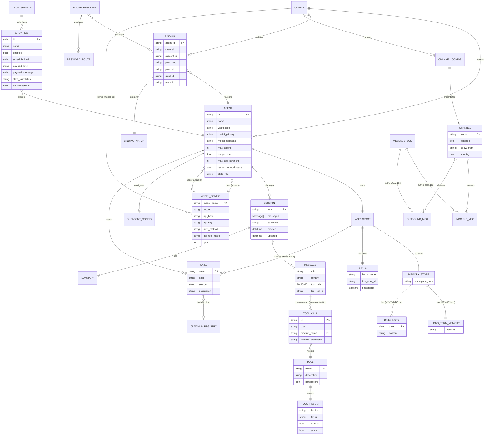

# 02 — Data Model

> Entity definitions, relationships, state machines, and an ER diagram for PicoClaw.
> All types are derived from Go struct definitions in the source code.

---

## 1. Entity Catalog

### 1.1 Agent

**Source:** `pkg/agent/instance.go`, `pkg/config/config.go`

An Agent is the central orchestrating entity — a configured AI assistant instance with its own workspace, model, tools, and skills.

| Field | Type | Constraints | Description |
|---|---|---|---|
| `id` | `string` | Required. Normalized: lowercase, `[a-z0-9_-]`, max 64 chars. Empty defaults to `"main"`. | Unique identifier |
| `default` | `bool` | At most one agent may be default | Falls back to this agent when no binding matches |
| `name` | `string` | Optional | Human-readable display name |
| `workspace` | `string` | Defaults to `~/.picoclaw/workspace` | Root directory for sessions, memory, skills, state |
| `model.primary` | `string` | Required (inherits from `agents.defaults.model`) | Primary LLM model identifier |
| `model.fallbacks` | `[]string` | Optional | Ordered list of fallback models |
| `max_tokens` | `int` | Default: `8192` | Max output tokens per LLM call |
| `temperature` | `*float64` | Default: `nil` (provider decides) | LLM sampling temperature |
| `max_tool_iterations` | `int` | Default: `20` | Hard cap on tool calls per conversation turn |
| `restrict_to_workspace` | `bool` | Default: `true` | Sandbox file operations to workspace |
| `skills` | `[]string` | Optional | Allow-list of skill names (empty = all skills) |
| `subagents.allow_agents` | `[]string` | `["*"]` = all, `[]` = none | Which agents this one may spawn |
| `subagents.model` | `AgentModelConfig` | Optional | Override model for spawned subagents |

**Implicit agent:** If no agents are configured, the system creates an implicit agent with `id: "main"` using all defaults.

---

### 1.2 Channel

**Source:** `pkg/channels/base.go`, `pkg/config/config.go`

A Channel is a messaging platform adapter. It receives inbound messages from users and delivers outbound responses.

| Field | Type | Constraints | Description |
|---|---|---|---|
| `name` | `string` | One of 12 known values (see below) | Channel identifier |
| `enabled` | `bool` | Default: `false` | Whether the channel is active |
| `allow_from` | `FlexibleStringSlice` | Accepts strings and numbers | Platform-specific user IDs permitted to interact |
| *(auth fields)* | varies | Channel-specific | Tokens, secrets, webhook URLs — see below |

**Supported channels and their auth fields:**

| Channel | Key Auth Fields |
|---|---|
| `telegram` | `token`, `proxy` |
| `discord` | `token`, `mention_only` |
| `slack` | `bot_token`, `app_token` |
| `wecom` | `token`, `encoding_aes_key`, `webhook_url`, `webhook_host`, `webhook_port`, `webhook_path`, `reply_timeout` |
| `wecom_app` | `corp_id`, `corp_secret`, `agent_id`, `token`, `encoding_aes_key`, `webhook_host`, `webhook_port`, `webhook_path`, `reply_timeout` |
| `feishu` | `app_id`, `app_secret`, `encrypt_key`, `verification_token` |
| `dingtalk` | `client_id`, `client_secret` |
| `qq` | `app_id`, `app_secret` |
| `line` | `channel_secret`, `channel_access_token`, `webhook_host`, `webhook_port`, `webhook_path` |
| `onebot` | `ws_url`, `access_token`, `reconnect_interval`, `group_trigger_prefix` |
| `whatsapp` | `bridge_url` |
| `maixcam` | `host`, `port` |

**Channel interface contract:**

```
Start(ctx)    → error       // Connect to platform, begin receiving
Stop(ctx)     → error       // Disconnect gracefully
Send(ctx,msg) → error       // Deliver outbound message
IsRunning()   → bool        // Current connection state
IsAllowed(id) → bool        // Check sender against allow_from
```

---

### 1.3 Session

**Source:** `pkg/session/manager.go`

A Session holds the conversation history between a user (or group) and an agent. It is the primary unit of conversational state.

| Field | Type | Constraints | Description |
|---|---|---|---|
| `key` | `string` | Composite key (see Session Key format below) | Unique session identifier |
| `messages` | `[]Message` | Append-only during a turn; truncatable | Ordered conversation history |
| `summary` | `string` | Optional, auto-generated | Condensed history for context window management |
| `created` | `time.Time` | Set once at creation | Session creation timestamp |
| `updated` | `time.Time` | Updated on every message add | Last modification timestamp |

**Session key format** (determined by `dm_scope` config):

| DM Scope | Key Pattern | Example |
|---|---|---|
| `main` | `agent:{agentId}:main` | `agent:main:main` |
| `per-peer` | `agent:{agentId}:direct:{peerId}` | `agent:main:direct:12345` |
| `per-channel-peer` | `agent:{agentId}:{channel}:direct:{peerId}` | `agent:main:telegram:direct:12345` |
| `per-account-channel-peer` | `agent:{agentId}:{channel}:{accountId}:direct:{peerId}` | `agent:main:telegram:default:direct:12345` |
| *(group messages)* | `agent:{agentId}:{channel}:group:{groupId}` | `agent:main:discord:group:98765` |

**Persistence:** JSON file at `{workspace}/sessions/{sanitized_key}.json`. Colons in keys are replaced with underscores. Atomic temp-file-then-rename writes.

---

### 1.4 Message

**Source:** `pkg/providers/types.go` (protocol types)

A Message is a single turn in a conversation. It maps directly to the LLM chat completion format.

| Field | Type | Constraints | Description |
|---|---|---|---|
| `role` | `string` | One of: `"system"`, `"user"`, `"assistant"`, `"tool"` | Message author role |
| `content` | `string` | Required (may be empty for tool-call-only assistant turns) | Message body text |
| `tool_calls` | `[]ToolCall` | Present only when `role = "assistant"` | Tool invocations requested by the LLM |
| `tool_call_id` | `string` | Present only when `role = "tool"` | Correlates this result to a specific tool call |

---

### 1.5 Tool

**Source:** `pkg/tools/types.go`, `pkg/tools/base.go`

A Tool is an executable function registered in the global tool registry. Tools are invoked by the LLM during the agent loop.

| Field | Type | Constraints | Description |
|---|---|---|---|
| `name` | `string` | Unique within registry | Tool identifier (e.g., `read_file`, `exec`, `web_search`) |
| `description` | `string` | Required | Human-readable description sent to the LLM |
| `parameters` | `map[string]any` | JSON Schema format | Parameter definitions for LLM tool calling |

**Tool variants (interfaces):**

| Interface | Extra Capability |
|---|---|
| `Tool` | Base: `Execute(ctx, args) → *ToolResult` |
| `ContextualTool` | Receives `channel` and `chatID` before execution via `SetContext()` |
| `AsyncTool` | Receives a callback via `SetCallback()` for deferred result delivery |

**ToolResult structure:**

| Field | Type | Description |
|---|---|---|
| `ForLLM` | `string` | Text result sent back to the LLM as tool output |
| `ForUI` | `string` | Optional: direct display to user (bypasses LLM) |
| `IsError` | `bool` | Whether the tool execution failed |
| `Async` | `bool` | Whether the result is still pending |
| `Raw` | `any` | Internal raw data (not serialized to LLM) |

---

### 1.6 ToolCall

**Source:** `pkg/providers/types.go`

A ToolCall represents the LLM's request to invoke a specific tool.

| Field | Type | Constraints | Description |
|---|---|---|---|
| `id` | `string` | Provider-generated, unique per response | Correlation ID |
| `type` | `string` | Typically `"function"` | Call type |
| `function.name` | `string` | Must match a registered tool | Tool to invoke |
| `function.arguments` | `string` | JSON-encoded | Serialized arguments |
| `name` | `string` | Alternative to `function.name` (provider-dependent) | Direct tool name |
| `arguments` | `map[string]any` | Alternative to `function.arguments` (pre-parsed) | Direct arguments |

---

### 1.7 Skill

**Source:** `pkg/skills/loader.go`, `pkg/skills/installer.go`, `pkg/skills/clawhub_registry.go`

A Skill is a pluggable capability — a markdown-defined prompt extension that gives an agent specialized knowledge or instructions.

| Field | Type | Constraints | Description |
|---|---|---|---|
| `name` | `string` | 1–64 chars, pattern: `^[a-zA-Z0-9]+(-[a-zA-Z0-9]+)*$` | Skill identifier |
| `path` | `string` | Absolute filesystem path to `SKILL.md` | Location on disk |
| `source` | `string` | One of: `"workspace"`, `"global"`, `"builtin"` | Origin layer |
| `description` | `string` | 1–1024 chars | Human-readable summary |

**Three-tier loading cascade** (higher priority overrides lower):

| Priority | Location | Scope |
|---|---|---|
| 1 (highest) | `{workspace}/skills/` | Per-agent |
| 2 | `~/.picoclaw/skills/` | Global (shared across agents) |
| 3 (lowest) | `{picoclaw_binary_dir}/workspace/skills/` | Built-in defaults |

**Remote skill metadata (ClawHub):**

| Field | Type | Description |
|---|---|---|
| `slug` | `string` | Registry identifier |
| `display_name` | `string` | Human-readable name |
| `summary` | `string` | Short description |
| `latest_version` | `string` | Most recent version |
| `is_malware_blocked` | `bool` | Flagged by moderation |
| `is_suspicious` | `bool` | Flagged as suspicious |
| `registry_name` | `string` | Source registry |

---

### 1.8 Binding

**Source:** `pkg/config/config.go`, `pkg/routing/route.go`

A Binding maps a message source pattern to a target agent. Bindings are evaluated in priority order.

| Field | Type | Constraints | Description |
|---|---|---|---|
| `agent_id` | `string` | Must reference a configured agent | Target agent |
| `match.channel` | `string` | Required | Channel name to match |
| `match.account_id` | `string` | Optional. `"*"` = wildcard. Empty = default account. | Account/workspace filter |
| `match.peer.kind` | `string` | `"direct"`, `"group"`, or `"channel"` | Peer type |
| `match.peer.id` | `string` | Platform-specific ID | Peer identity |
| `match.guild_id` | `string` | Optional | Server/workspace ID |
| `match.team_id` | `string` | Optional | Team ID |

---

### 1.9 Provider (ModelConfig)

**Source:** `pkg/config/config.go`

A Provider represents an LLM backend configuration. The new `model_list` format supersedes the legacy `providers` section.

| Field | Type | Constraints | Description |
|---|---|---|---|
| `model_name` | `string` | Required | User-facing alias (e.g., `"gpt4"`) |
| `model` | `string` | Required. Format: `{protocol}/{model-id}` | Full model identifier (e.g., `"openai/gpt-4o"`) |
| `api_base` | `string` | URL | Provider API endpoint |
| `api_key` | `string` | Sensitive | Authentication key |
| `proxy` | `string` | Optional URL | HTTP proxy |
| `auth_method` | `string` | `"oauth"`, `"token"`, or empty | Authentication mechanism |
| `connect_mode` | `string` | `"stdio"`, `"grpc"`, or empty | Connection mode for CLI-based providers |
| `workspace` | `string` | Optional path | Workspace for CLI providers |
| `rpm` | `int` | Optional, 0 = unlimited | Requests-per-minute rate limit |
| `max_tokens_field` | `string` | Optional | Custom field name for max tokens parameter |

**Protocol prefixes and their provider types:**

| Prefix | Provider Type | Example |
|---|---|---|
| `openai/` | OpenAI-compatible HTTP | `openai/gpt-4o` |
| `anthropic/` | Anthropic HTTP | `anthropic/claude-sonnet-4-6` |
| `antigravity/` | Google Cloud Code Assist (OAuth) | `antigravity/gemini-2.0-flash` |
| `claude-cli/` | Claude CLI subprocess | `claude-cli/claude-sonnet-4-6` |
| `codex-cli/` | Codex CLI subprocess | `codex-cli/codex-mini` |
| `github-copilot/` | GitHub Copilot gRPC/stdio | `github-copilot/gpt-4o` |
| *(no prefix)* | Defaults to OpenAI-compatible | `gpt-4o` |

---

### 1.10 CronJob

**Source:** `pkg/cron/service.go`

A CronJob represents a scheduled task that triggers agent processing at defined intervals.

| Field | Type | Constraints | Description |
|---|---|---|---|
| `id` | `string` | Unique | Job identifier |
| `name` | `string` | Required | Human-readable name |
| `enabled` | `bool` | Default: `true` | Whether the job is active |
| `schedule.kind` | `string` | One of: `"at"`, `"every"`, `"cron"` | Schedule type |
| `schedule.atMs` | `*int64` | Used when `kind = "at"` | Absolute timestamp (ms since epoch) |
| `schedule.everyMs` | `*int64` | Used when `kind = "every"` | Interval in milliseconds |
| `schedule.expr` | `string` | Used when `kind = "cron"` | Cron expression (5-field) |
| `schedule.tz` | `string` | Optional IANA timezone | Timezone for cron expressions |
| `payload.kind` | `string` | Currently: `"agent_turn"` | What to execute |
| `payload.message` | `string` | Required | Message to send to the agent |
| `payload.command` | `string` | Optional | Shell command alternative |
| `payload.deliver` | `bool` | Default: `false` | Whether to deliver result to a channel |
| `payload.channel` | `string` | Required if `deliver = true` | Target channel for delivery |
| `payload.to` | `string` | Required if `deliver = true` | Target chat/user for delivery |
| `state.nextRunAtMs` | `*int64` | Computed | Next scheduled execution |
| `state.lastRunAtMs` | `*int64` | Updated after run | Last execution time |
| `state.lastStatus` | `string` | `"ok"` or `"error"` | Outcome of last run |
| `state.lastError` | `string` | Optional | Error message from last run |
| `deleteAfterRun` | `bool` | Default: `false` | Auto-delete after one-time execution |
| `createdAtMs` | `int64` | Set at creation | Creation timestamp (ms) |
| `updatedAtMs` | `int64` | Updated on modification | Last update timestamp (ms) |

**Persistence:** JSON file (`CronStore` with `version` + `jobs[]`) with atomic writes.

---

### 1.11 InboundMessage / OutboundMessage

**Source:** `pkg/bus/types.go`

Bus messages are the internal representation of messages flowing through the system.

**InboundMessage** (channel → agent):

| Field | Type | Description |
|---|---|---|
| `channel` | `string` | Source channel name |
| `sender_id` | `string` | Platform-specific sender ID |
| `chat_id` | `string` | Platform-specific chat/conversation ID |
| `content` | `string` | Message text |
| `media` | `[]string` | Media attachment URLs |
| `session_key` | `string` | Pre-resolved session key (optional) |
| `metadata` | `map[string]string` | Additional platform-specific data |

**OutboundMessage** (agent → channel):

| Field | Type | Description |
|---|---|---|
| `channel` | `string` | Target channel name |
| `chat_id` | `string` | Target chat/conversation ID |
| `content` | `string` | Response text |

---

### 1.12 State

**Source:** `pkg/state/state.go`

Lightweight persistent state tracking the last-used channel and chat for CLI continuity.

| Field | Type | Description |
|---|---|---|
| `last_channel` | `string` | Last active channel name |
| `last_chat_id` | `string` | Last active chat ID |
| `timestamp` | `time.Time` | Last update time |

**Persistence:** `{workspace}/state/state.json`, atomic writes.

---

## 2. Entity Relationship Diagram



---

## 3. State Machines

### 3.1 Channel Lifecycle

```
                 ┌──────────┐
   initChannels  │          │
   ────────────▶ │ Created  │
                 │          │
                 └────┬─────┘
                      │ Start(ctx)
                      ▼
                 ┌──────────┐
                 │          │  IsRunning() = true
                 │ Running  │◀─────────────────┐
                 │          │                  │
                 └────┬─────┘                  │
                      │                        │
              Stop(ctx)│            Reconnect   │
                      │           (channel-     │
                      ▼            specific)    │
                 ┌──────────┐                  │
                 │          │──────────────────┘
                 │ Stopped  │  IsRunning() = false
                 │          │
                 └──────────┘
```

### 3.2 CronJob Lifecycle

```
                 ┌──────────┐
   Add/Create    │          │
   ────────────▶ │ Enabled  │◀──────────────────────┐
                 │          │                       │
                 └────┬─────┘                       │
                      │ schedule triggers           │
                      ▼                             │
                 ┌──────────┐                       │
                 │          │  lastStatus = "ok"     │
                 │ Running  │───────────────────────┘
                 │          │     (if recurring)
                 └────┬─────┘
                      │
           ┌──────────┼──────────┐
           │          │          │
           ▼          ▼          ▼
      lastStatus  lastStatus  deleteAfterRun
      = "ok"      = "error"   = true
      (one-time)  (logged)         │
           │          │            ▼
           ▼          │       ┌──────────┐
      ┌──────────┐    │       │          │
      │ Disabled │    └──────▶│ Deleted  │
      └──────────┘            └──────────┘
```

### 3.3 Session Message Flow (per turn)

```
                 ┌──────────────┐
   user sends    │              │
   ────────────▶ │ Awaiting     │
                 │ User Input   │
                 └──────┬───────┘
                        │ AddMessage(role="user")
                        ▼
                 ┌──────────────┐
                 │              │
                 │ LLM          │◀──────────────────┐
                 │ Processing   │                   │
                 └──────┬───────┘                   │
                        │                           │
              ┌─────────┴─────────┐                 │
              │                   │                 │
              ▼                   ▼                 │
     finish_reason =      finish_reason =           │
     "stop"/"length"      "tool_calls"              │
              │                   │                 │
              ▼                   ▼                 │
     ┌────────────┐      ┌───────────────┐          │
     │ Response   │      │ Tool Exec     │          │
     │ Delivered  │      │ (iteration++) │          │
     └────────────┘      └───────┬───────┘          │
                                 │                  │
                        iteration < max?            │
                           yes ──────────────────────┘
                           no ──▶ Force stop, deliver partial
```

### 3.4 Provider Fallback Chain

```
                 ┌──────────────┐
                 │              │
                 │  Primary     │
                 │  Model       │
                 └──────┬───────┘
                        │
                   Success? ──yes──▶ Return response
                        │
                        no (FailoverError)
                        │
              ┌─────────┴─────────┐
              │                   │
         Retriable?          Non-retriable?
         (RateLimit,         (Auth, Billing,
          Timeout,            Format)
          Overload)               │
              │                   ▼
              ▼              Return error
     ┌──────────────┐
     │ Fallback[0]  │
     └──────┬───────┘
            │
       Success? ──yes──▶ Return response
            │
            no ──▶ Fallback[1] ──▶ ... ──▶ Fallback[N] ──▶ Return error
```

### 3.5 Routing Resolution

```
   InboundMessage
        │
        ▼
   Filter bindings by (channel, accountID)
        │
        ├──▶ Match peer.id?              ──yes──▶ return (matchedBy: "binding.peer")
        │
        ├──▶ Match parentPeer.id?        ──yes──▶ return (matchedBy: "binding.peer.parent")
        │
        ├──▶ Match guildID?              ──yes──▶ return (matchedBy: "binding.guild")
        │
        ├──▶ Match teamID?               ──yes──▶ return (matchedBy: "binding.team")
        │
        ├──▶ Match accountID (non-*)?    ──yes──▶ return (matchedBy: "binding.account")
        │
        ├──▶ Match accountID = "*"?      ──yes──▶ return (matchedBy: "binding.channel")
        │
        └──▶ No match                    ────────▶ return (matchedBy: "default", agentID: default agent)
```

---

## 4. Storage Layout

All data is persisted to the filesystem. There is no database engine.

```
~/.picoclaw/
├── config.json                                    # Root configuration (all entities)
│
├── workspace/                                     # Default agent workspace
│   ├── AGENT.md                                   # Bootstrap: agent behavior
│   ├── IDENTITY.md                                # Bootstrap: agent identity
│   ├── USER.md                                    # Bootstrap: user context
│   ├── SOUL.md                                    # Bootstrap: personality
│   │
│   ├── sessions/
│   │   ├── agent_main_main.json                   # Session (key sanitized: ":" → "_")
│   │   ├── agent_main_telegram_direct_12345.json
│   │   ├── agent_main_main_summary                # Session summary (plain text)
│   │   └── ...
│   │
│   ├── state/
│   │   └── state.json                             # Last channel/chatID
│   │
│   ├── memory/
│   │   ├── MEMORY.md                              # Long-term memory
│   │   └── 202602/
│   │       ├── 20260221.md                        # Daily note
│   │       ├── 20260222.md
│   │       └── 20260223.md
│   │
│   ├── skills/
│   │   ├── weather/SKILL.md                       # Workspace-level skills
│   │   ├── github/SKILL.md
│   │   └── ...
│   │
│   └── cron/
│       └── cron.json                              # CronStore (version + jobs[])
│
├── skills/                                        # Global skills (tier 2)
│   └── {skill-name}/SKILL.md
│
└── auth/
    └── tokens.json                                # OAuth token store
```

**Write safety:** All mutable files (sessions, state, cron store) use atomic temp-file-then-rename.

**Session key sanitization:** `:` → `_` for filesystem compatibility. `filepath.IsLocal()` is checked to prevent directory traversal.

---

## 5. Key Constraints Summary

| Entity | Constraint | Value | Enforcement |
|---|---|---|---|
| Agent ID | Max length | 64 chars | `pkg/routing/agent_id.go` |
| Agent ID | Pattern | `^[a-z0-9][a-z0-9_-]*$` | Normalization at resolve time |
| Agent ID | Empty handling | Defaults to `"main"` | `pkg/routing/agent_id.go` |
| Skill name | Pattern | `^[a-zA-Z0-9]+(-[a-zA-Z0-9]+)*$` | `pkg/skills/installer.go` |
| Skill name | Max length | 64 chars | Validation at install time |
| Skill description | Max length | 1024 chars | Validation at install time |
| Tool iterations | Hard cap | 20 (configurable) | `pkg/agent/loop.go` |
| Max tokens | Default | 8192 | `pkg/config/defaults.go` |
| Bus buffer | Inbound | 100 messages | `pkg/bus/bus.go` |
| Bus buffer | Outbound | 100 messages | `pkg/bus/bus.go` |
| ClawHub max ZIP | Default | 50 MB | `pkg/skills/clawhub_registry.go` |
| ClawHub max response | Default | 2 MB | `pkg/skills/clawhub_registry.go` |
| Skill search cache | Max entries | 100 | `pkg/config/defaults.go` |
| Skill search cache | TTL | 3600 s | `pkg/config/defaults.go` |
| Cron exec timeout | Default | 5 minutes | `pkg/config/defaults.go` |
| Heartbeat interval | Minimum | 5 minutes | `pkg/config/config.go` |
| Health server | Read/write timeout | 5 seconds | `pkg/health/server.go` |
