# 02 — Data Model

> ZeroClaw Technical Blueprint | File 2 of 5

---

## 1. Entity Catalog

### 1.1 MemoryEntry

The core unit of persistent knowledge. Stored in SQLite (`brain.db`) or alternative backends.

| Field | Type | Constraints | Notes |
|---|---|---|---|
| `id` | `String` | PK, NOT NULL | UUID v4 |
| `key` | `String` | UNIQUE, NOT NULL | Logical key for upsert/recall |
| `content` | `String` | NOT NULL | Stored text content |
| `category` | `MemoryCategory` | NOT NULL, DEFAULT `'core'` | Enum: `Core`, `Daily`, `Conversation`, `Custom(String)` |
| `embedding` | `BLOB` | Nullable | Float vector for semantic search |
| `created_at` | `String` | NOT NULL | ISO 8601 timestamp |
| `updated_at` | `String` | NOT NULL | ISO 8601 timestamp |
| `session_id` | `String` | Nullable | Scopes entry to a session (migration-added) |
| `score` | `Option<f64>` | Transient (not stored) | Hybrid search relevance score |

**MemoryCategory enum:**

| Variant | Serde key | Purpose |
|---|---|---|
| `Core` | `"core"` | Persistent identity/config knowledge |
| `Daily` | `"daily"` | Day-scoped operational notes |
| `Conversation` | `"conversation"` | Session-scoped dialogue context |
| `Custom(String)` | `"custom"` | User-defined categories |

**Indexes:** `idx_memories_category`, `idx_memories_key`, `idx_memories_session`

**FTS5 full-text index:** `memories_fts(key, content)` — auto-synced via INSERT/DELETE/UPDATE triggers. Uses BM25 scoring for keyword search.

---

### 1.2 EmbeddingCache

LRU cache for computed vector embeddings, avoiding redundant API calls.

| Field | Type | Constraints | Notes |
|---|---|---|---|
| `content_hash` | `String` | PK | SHA-256 of input text (truncated to 16 hex chars) |
| `embedding` | `BLOB` | NOT NULL | Cached embedding vector |
| `created_at` | `String` | NOT NULL | ISO 8601 |
| `accessed_at` | `String` | NOT NULL | ISO 8601, updated on each cache hit |

**Index:** `idx_cache_accessed` — used for LRU eviction (oldest `accessed_at` first).

**Eviction:** When entry count exceeds `MemoryConfig.embedding_cache_size` (default: 10,000), oldest entries by `accessed_at` are deleted.

---

### 1.3 CronJob

A scheduled task that runs shell commands or agent prompts on a time expression.

| Field | Type | Constraints | Notes |
|---|---|---|---|
| `id` | `String` | PK | UUID v4 |
| `expression` | `String` | NOT NULL | Raw schedule expression (cron, `at:`, `every:`) |
| `schedule` | `String` | Nullable | JSON-serialized `Schedule` enum |
| `command` | `String` | NOT NULL | Shell command or agent prompt text |
| `prompt` | `String` | Nullable | Agent prompt override |
| `name` | `String` | Nullable | Human-readable display name |
| `job_type` | `String` | NOT NULL, DEFAULT `'shell'` | `"shell"` or `"agent"` |
| `session_target` | `String` | NOT NULL, DEFAULT `'isolated'` | `"isolated"` or `"main"` |
| `model` | `String` | Nullable | Override model for agent-type jobs |
| `enabled` | `INTEGER` | NOT NULL, DEFAULT `1` | Boolean as integer |
| `delivery` | `String` | Nullable | JSON-serialized `DeliveryConfig` |
| `delete_after_run` | `INTEGER` | NOT NULL, DEFAULT `0` | One-shot flag |
| `created_at` | `String` | NOT NULL | ISO 8601 |
| `next_run` | `String` | NOT NULL | ISO 8601, used for scheduler polling |
| `last_run` | `String` | Nullable | ISO 8601 |
| `last_status` | `String` | Nullable | `"ok"` or `"error"` |
| `last_output` | `String` | Nullable | Truncated at 16,384 bytes |

**Index:** `idx_cron_jobs_next_run`

**Schedule enum** (tagged union, `kind` discriminator):
- `Cron { expr: String, tz: Option<String> }` — standard cron expression with optional timezone
- `At { at: DateTime<Utc> }` — one-shot absolute time
- `Every { every_ms: u64 }` — repeating interval in milliseconds

**DeliveryConfig:**

| Field | Type | Default | Notes |
|---|---|---|---|
| `mode` | `String` | `"none"` | Delivery mode |
| `channel` | `Option<String>` | `None` | Target channel name |
| `to` | `Option<String>` | `None` | Target recipient |
| `best_effort` | `bool` | `true` | Don't fail job on delivery failure |

---

### 1.4 CronRun

Execution history record for a cron job. Pruned to `CronConfig.max_run_history` (default: 50) per job.

| Field | Type | Constraints | Notes |
|---|---|---|---|
| `id` | `i64` | PK AUTOINCREMENT | |
| `job_id` | `String` | FK → `cron_jobs.id` ON DELETE CASCADE | |
| `started_at` | `String` | NOT NULL | ISO 8601 |
| `finished_at` | `String` | NOT NULL | ISO 8601 |
| `status` | `String` | NOT NULL | `"ok"` or `"error"` |
| `output` | `String` | Nullable | Truncated at 16,384 bytes |
| `duration_ms` | `INTEGER` | Nullable | Execution time in milliseconds |

**Indexes:** `idx_cron_runs_job_id`, `idx_cron_runs_started_at`, `idx_cron_runs_job_started` (composite)

---

### 1.5 CostRecord

Per-request token usage and cost tracking (in-memory, aggregated to summaries).

| Field | Type | Notes |
|---|---|---|
| `id` | `String` | UUID v4 |
| `session_id` | `String` | Logical session identifier |
| `usage.model` | `String` | Model identifier |
| `usage.input_tokens` | `u64` | Prompt tokens consumed |
| `usage.output_tokens` | `u64` | Completion tokens consumed |
| `usage.total_tokens` | `u64` | input + output |
| `usage.cost_usd` | `f64` | `(tokens / 1M) * price`; clamps negative to 0.0 |
| `usage.timestamp` | `DateTime<Utc>` | When the request occurred |

**CostSummary** (aggregation view):

| Field | Type |
|---|---|
| `session_cost_usd` | `f64` |
| `daily_cost_usd` | `f64` |
| `monthly_cost_usd` | `f64` |
| `total_tokens` | `u64` |
| `request_count` | `usize` |
| `by_model` | `HashMap<String, ModelStats>` |

**ModelPricing** (hardcoded + user-configurable):

| Model | Input ($/1M) | Output ($/1M) |
|---|---|---|
| `anthropic/claude-sonnet-4-*` | 3.00 | 15.00 |
| `anthropic/claude-opus-4-*` | 15.00 | 75.00 |
| `anthropic/claude-3.5-sonnet` | 3.00 | 15.00 |
| `anthropic/claude-3-haiku` | 0.25 | 1.25 |
| `openai/gpt-4o` | 5.00 | 15.00 |
| `openai/gpt-4o-mini` | 0.15 | 0.60 |
| `openai/o1-preview` | 15.00 | 60.00 |
| `google/gemini-2.0-flash` | 0.10 | 0.40 |
| `google/gemini-1.5-pro` | 1.25 | 5.00 |

**BudgetCheck enum:**
- `Allowed` — under limits
- `Warning { current_usd, limit_usd, period }` — past `warn_at_percent` (80% default)
- `Exceeded { current_usd, limit_usd, period }` — hard limit hit

---

### 1.6 AuditEvent

Security audit trail entries, written as NDJSON (newline-delimited JSON).

| Field | Type | Notes |
|---|---|---|
| `timestamp` | `DateTime<Utc>` | Set at creation |
| `event_id` | `String` | UUID v4 |
| `event_type` | `AuditEventType` | See enum below |
| `actor` | `Option<Actor>` | Who triggered the event |
| `action` | `Option<Action>` | What was attempted |
| `result` | `Option<ExecutionResult>` | What happened |
| `security` | `SecurityContext` | Policy state at time of event |

**AuditEventType enum:**

| Variant | Serde key | Trigger |
|---|---|---|
| `CommandExecution` | `"command_execution"` | Shell command invoked |
| `FileAccess` | `"file_access"` | File read/write attempted |
| `ConfigChange` | `"config_change"` | Runtime config modified |
| `AuthSuccess` | `"auth_success"` | Pairing/token auth succeeded |
| `AuthFailure` | `"auth_failure"` | Pairing/token auth failed |
| `PolicyViolation` | `"policy_violation"` | Security policy check rejected |
| `SecurityEvent` | `"security_event"` | General security anomaly |

**Nested structs:**

| Struct | Fields |
|---|---|
| `Actor` | `channel: String`, `user_id: Option<String>`, `username: Option<String>` |
| `Action` | `command: Option<String>`, `risk_level: Option<String>`, `approved: bool`, `allowed: bool` |
| `ExecutionResult` | `success: bool`, `exit_code: Option<i32>`, `duration_ms: Option<u64>`, `error: Option<String>` |
| `SecurityContext` | `policy_violation: bool`, `rate_limit_remaining: Option<u32>`, `sandbox_backend: Option<String>` |

**Storage:** File at `{workspace}/audit.log`, rotated at `AuditConfig.max_size_mb` (default: 100 MB) with up to 10 numbered backups.

---

### 1.7 ComponentHealth

Runtime health status per daemon component. In-memory singleton (`HealthRegistry`).

| Field | Type | Notes |
|---|---|---|
| `status` | `String` | `"starting"`, `"ok"`, or `"error"` |
| `updated_at` | `String` | RFC 3339 |
| `last_ok` | `Option<String>` | Last RFC 3339 timestamp when status was "ok" |
| `last_error` | `Option<String>` | Last error message |
| `restart_count` | `u64` | Monotonic, saturating counter |

**HealthSnapshot** (point-in-time aggregation):

| Field | Type |
|---|---|
| `pid` | `u32` |
| `updated_at` | `String` (RFC 3339) |
| `uptime_seconds` | `u64` |
| `components` | `BTreeMap<String, ComponentHealth>` |

Tracked components: `daemon`, `gateway`, `channels`, `heartbeat`, `scheduler`.

---

### 1.8 AieosIdentity

Optional agent personality/identity document (AIEOS v1.1 format). Loaded from config, not persisted to database.

| Section | Key Fields |
|---|---|
| `identity` | `names` (first, last, nickname, full), `bio`, `origin`, `residence` |
| `psychology` | `neural_matrix: HashMap<String, f64>`, `mbti`, `ocean` (Big Five traits as f64), `moral_compass` |
| `linguistics` | `style`, `formality`, `catchphrases`, `forbidden_words` |
| `motivations` | `core_drive`, `short_goals`, `long_goals`, `fears` |
| `capabilities` | `skills`, `tools` (Vec<String>) |
| `physicality` | `appearance`, `avatar_description` |
| `history` | `origin_story`, `education`, `occupation` |
| `interests` | `hobbies`, `favorites`, `lifestyle` |

All sections are `Option<T>` — the entire identity is optional.

---

### 1.9 Provider Conversation Types

In-memory message types flowing through the agent orchestration loop.

**ChatMessage:**

| Field | Type | Values |
|---|---|---|
| `role` | `String` | `"system"`, `"user"`, `"assistant"`, `"tool"` |
| `content` | `String` | Message text |

**ChatResponse:**

| Field | Type |
|---|---|
| `text` | `Option<String>` |
| `tool_calls` | `Vec<ToolCall>` |
| `usage` | `Option<TokenUsage>` |
| `reasoning_content` | `Option<String>` |

**ToolCall:**

| Field | Type |
|---|---|
| `id` | `String` |
| `name` | `String` |
| `arguments` | `String` (JSON) |

**ConversationMessage enum** (tagged: `type` + `data`):
- `Chat(ChatMessage)` — user or system message
- `AssistantToolCalls { text, tool_calls, reasoning_content }` — assistant response with tool invocations
- `ToolResults(Vec<ToolResultMessage>)` — tool execution results fed back

---

### 1.10 ToolSpec / ToolResult

Tool interface contracts used by the agent and exposed via API.

**ToolSpec:**

| Field | Type | Notes |
|---|---|---|
| `name` | `String` | Canonical tool name (e.g., `"shell"`, `"file_read"`) |
| `description` | `String` | Human-readable description |
| `parameters` | `serde_json::Value` | JSON Schema object defining input parameters |

**ToolResult:**

| Field | Type | Notes |
|---|---|---|
| `success` | `bool` | Whether execution succeeded |
| `output` | `String` | Result content |
| `error` | `Option<String>` | Error message if failed |

---

### 1.11 ScoutResult / EvalResult (SkillForge)

Skill discovery and evaluation pipeline entities.

**ScoutResult** (discovered skill candidate):

| Field | Type | Notes |
|---|---|---|
| `name` | `String` | Skill/repo name |
| `url` | `String` | Source URL (dedup key) |
| `description` | `String` | |
| `stars` | `u64` | GitHub stars or equivalent |
| `language` | `Option<String>` | Primary language |
| `updated_at` | `Option<DateTime<Utc>>` | Last update time |
| `source` | `ScoutSource` | `GitHub`, `ClawHub`, or `HuggingFace` |
| `owner` | `String` | Repository owner |
| `has_license` | `bool` | Whether a license file exists |

**EvalResult** (scored candidate):

| Field | Type | Notes |
|---|---|---|
| `candidate` | `ScoutResult` | Original discovery |
| `scores.compatibility` | `f64` | Weight: 0.30 (Rust=1.0, Python/TS/JS=0.6, other=0.2-0.3) |
| `scores.quality` | `f64` | Weight: 0.35 (`log2(stars+1)/10`, clamped) |
| `scores.security` | `f64` | Weight: 0.35 (license +0.3, bad patterns -0.5, recency +0.2) |
| `total_score` | `f64` | Weighted sum |
| `recommendation` | `Recommendation` | `Auto` (≥0.7), `Manual` (≥0.4), `Skip` (<0.4) |

---

### 1.12 DatasheetChunk (Hardware RAG)

| Field | Type | Notes |
|---|---|---|
| `board` | `Option<String>` | e.g., `"nucleo-f401re"`; `None` for generic datasheets |
| `source` | `String` | Relative file path |
| `content` | `String` | Chunk text (max 512 tokens) |

**PinAliases:** `HashMap<String, u32>` per board — maps alias names to pin numbers. Parsed from markdown `## Pin Aliases` sections.

---

## 2. Entity Relationship Diagram

```mermaid
erDiagram
    Config ||--o{ MemoryEntry : "memory backend stores"
    Config ||--o{ CronJob : "scheduler manages"
    Config ||--|| SecurityPolicy : "autonomy config builds"
    Config ||--o{ DelegateAgentConfig : "agents map defines"
    Config ||--|| GatewayConfig : "gateway section"
    Config ||--|| CostConfig : "cost section"
    Config ||--|| ObservabilityConfig : "observability section"
    Config ||--o{ ChannelConfig : "channels_config contains"

    MemoryEntry ||--|| EmbeddingCache : "content hashes to"

    CronJob ||--o{ CronRun : "produces"
    CronJob }|--|| DeliveryConfig : "delivers via"

    Agent ||--|| Provider : "uses for LLM"
    Agent ||--o{ Tool : "registers"
    Agent ||--|| Memory : "reads/writes"
    Agent ||--|| Observer : "reports to"
    Agent ||--o{ ConversationMessage : "maintains history"
    Agent ||--o{ Skill : "loads"

    ConversationMessage ||--o{ ToolCall : "may contain"
    ToolCall ||--|| ToolResult : "produces"

    CostRecord ||--|| TokenUsage : "contains"
    CostRecord }o--|| CostSummary : "aggregates into"

    AuditEvent ||--o| Actor : "performed by"
    AuditEvent ||--o| Action : "describes"
    AuditEvent ||--o| ExecutionResult : "records"

    SecurityPolicy ||--|| ActionTracker : "rate limits via"

    HealthSnapshot ||--o{ ComponentHealth : "contains"

    ScoutResult ||--|| EvalResult : "evaluated as"
    EvalResult ||--|| Scores : "scored by"

    HardwareRag ||--o{ DatasheetChunk : "indexes"
    HardwareRag ||--o{ PinAliases : "maps per board"

    MemoryEntry {
        string id PK
        string key UK
        string content
        string category
        blob embedding
        string created_at
        string updated_at
        string session_id
    }

    EmbeddingCache {
        string content_hash PK
        blob embedding
        string created_at
        string accessed_at
    }

    CronJob {
        string id PK
        string expression
        string command
        string schedule_json
        string job_type
        string session_target
        string model
        bool enabled
        string delivery_json
        bool delete_after_run
        string created_at
        string next_run
        string last_run
        string last_status
        string last_output
    }

    CronRun {
        int id PK
        string job_id FK
        string started_at
        string finished_at
        string status
        string output
        int duration_ms
    }

    CostRecord {
        string id PK
        string session_id
        string model
        int input_tokens
        int output_tokens
        float cost_usd
        datetime timestamp
    }

    AuditEvent {
        datetime timestamp
        string event_id PK
        string event_type
        json actor
        json action
        json result
        json security
    }

    ComponentHealth {
        string name PK
        string status
        string updated_at
        string last_ok
        string last_error
        int restart_count
    }
```



---

## 3. State Machines

### 3.1 CronJob Lifecycle

```
                    ┌──────────────┐
                    │   Created    │
                    │ enabled=true │
                    │ next_run=T   │
                    └──────┬───────┘
                           │ scheduler polls: next_run <= now
                           ▼
                    ┌──────────────┐
                    │   Running    │
                    │ CronRun row  │
                    │ started_at=T │
                    └──────┬───────┘
                           │
                ┌──────────┴──────────┐
                ▼                     ▼
         ┌────────────┐        ┌────────────┐
         │ Completed  │        │  Failed    │
         │ status=ok  │        │ status=err │
         └─────┬──────┘        └─────┬──────┘
               │                     │
               └──────────┬──────────┘
                          │
               ┌──────────┴──────────┐
               ▼                     ▼
        ┌─────────────┐      ┌─────────────┐
        │ delete_after │      │ Rescheduled │
        │ _run=true   │      │ next_run=T' │
        │ → DELETED   │      │ last_run=T  │
        └─────────────┘      │ last_status │
                              └─────────────┘
                                     │
                                     └──→ (back to scheduler poll)
```

### 3.2 ComponentHealth Status

```
         mark_component_ok()         mark_component_error()
              ┌──────┐                    ┌──────┐
              │      ▼                    │      ▼
        ┌───────────────┐          ┌───────────────┐
  ──────► "starting"    ├──────────►   "error"     │
        └───────┬───────┘          └───────┬───────┘
                │                          │
                │ mark_component_ok()      │ mark_component_ok()
                ▼                          ▼
        ┌───────────────┐          ┌───────────────┐
        │    "ok"       ◄──────────┤    "ok"       │
        └───────┬───────┘          └───────────────┘
                │
                │ mark_component_error()
                ▼
        ┌───────────────┐
        │   "error"     │
        └───────────────┘

  Any state + bump_component_restart() → restart_count++
```

### 3.3 BudgetCheck (Cost Enforcement)

```
  CostRecord arrives
        │
        ▼
  ┌─────────────────────┐
  │ Aggregate by period  │
  │ (Session/Day/Month)  │
  └──────────┬──────────┘
             │
     ┌───────┴────────┐
     │ current < 80%  │──────────► Allowed
     │ of limit       │
     └───────┬────────┘
             │ current >= 80%
             │ and < 100%
             ▼
     ┌───────────────┐
     │   Warning     │──────────► Warning { current, limit, period }
     └───────┬───────┘
             │ current >= 100%
             ▼
     ┌───────────────┐
     │   Exceeded    │──────────► Exceeded { current, limit, period }
     └───────────────┘           (blocks further LLM calls unless allow_override)
```

### 3.4 SkillForge Recommendation

```
  ScoutResult discovered
        │
        ▼
  ┌─────────────────────────┐
  │ Evaluate scores:        │
  │  compatibility (0.30)   │
  │  quality      (0.35)    │
  │  security     (0.35)    │
  └──────────┬──────────────┘
             │
     ┌───────┴────────┐
     │ total >= 0.7   │──────────► Auto (auto-integrate)
     └───────┬────────┘
             │ total >= 0.4
             ▼
     ┌───────────────┐
     │   Manual      │──────────► Manual (human review needed)
     └───────┬───────┘
             │ total < 0.4
             ▼
     ┌───────────────┐
     │    Skip       │──────────► Skip (rejected)
     └───────────────┘
```

### 3.5 Hook Pipeline Execution

```
  Modifying hook event triggered
        │
        ▼
  ┌─────────────────────────────┐
  │ Sort handlers by priority   │
  │ (highest first, sequential) │
  └──────────┬──────────────────┘
             │
             ▼
  ┌──────────────────┐    Continue(T')    ┌──────────────────┐
  │ Hook handler #1  │──────────────────►│ Hook handler #2  │───► ... ───► Final value
  └──────────┬───────┘                   └──────────┬───────┘
             │                                      │
             │ Cancel(reason)                       │ Cancel(reason)
             ▼                                      ▼
  ┌──────────────────┐               ┌──────────────────┐
  │ Operation aborted│               │ Operation aborted│
  │ Error propagated │               │ Error propagated │
  └──────────────────┘               └──────────────────┘
```

### 3.6 Emergency Stop Levels

```
  E-Stop triggered
        │
        ├──► KillAll ──────────────► All agent activity halted
        │
        ├──► NetworkKill ──────────► All outbound network blocked
        │
        ├──► DomainBlock(domains) ─► Specific domain patterns blocked
        │
        └──► ToolFreeze(tools) ────► Specific tools frozen

  Resume requires:
    - OTP verification (if require_otp_to_resume=true)
    - ResumeSelector matching the active stop level
```

---

## 4. SQLite Schema Summary

### 4.1 Memory Database (`{workspace}/memory/brain.db`)

```sql
-- Core memory table
CREATE TABLE memories (
    id          TEXT PRIMARY KEY,
    key         TEXT NOT NULL UNIQUE,
    content     TEXT NOT NULL,
    category    TEXT NOT NULL DEFAULT 'core',
    embedding   BLOB,
    created_at  TEXT NOT NULL,
    updated_at  TEXT NOT NULL,
    session_id  TEXT
);
CREATE INDEX idx_memories_category ON memories(category);
CREATE INDEX idx_memories_key ON memories(key);
CREATE INDEX idx_memories_session ON memories(session_id);

-- Full-text search (auto-synced via triggers)
CREATE VIRTUAL TABLE memories_fts USING fts5(key, content, content=memories, content_rowid=rowid);

-- Embedding vector cache (LRU eviction)
CREATE TABLE embedding_cache (
    content_hash TEXT PRIMARY KEY,
    embedding    BLOB NOT NULL,
    created_at   TEXT NOT NULL,
    accessed_at  TEXT NOT NULL
);
CREATE INDEX idx_cache_accessed ON embedding_cache(accessed_at);

-- PRAGMA settings
PRAGMA journal_mode = WAL;
PRAGMA synchronous  = NORMAL;
PRAGMA mmap_size    = 8388608;
PRAGMA cache_size   = -2000;
PRAGMA temp_store   = MEMORY;
```

### 4.2 Cron Database (`{workspace}/cron/jobs.db`)

```sql
CREATE TABLE cron_jobs (
    id               TEXT PRIMARY KEY,
    expression       TEXT NOT NULL,
    command          TEXT NOT NULL,
    schedule         TEXT,
    job_type         TEXT NOT NULL DEFAULT 'shell',
    prompt           TEXT,
    name             TEXT,
    session_target   TEXT NOT NULL DEFAULT 'isolated',
    model            TEXT,
    enabled          INTEGER NOT NULL DEFAULT 1,
    delivery         TEXT,
    delete_after_run INTEGER NOT NULL DEFAULT 0,
    created_at       TEXT NOT NULL,
    next_run         TEXT NOT NULL,
    last_run         TEXT,
    last_status      TEXT,
    last_output      TEXT
);
CREATE INDEX idx_cron_jobs_next_run ON cron_jobs(next_run);

CREATE TABLE cron_runs (
    id          INTEGER PRIMARY KEY AUTOINCREMENT,
    job_id      TEXT NOT NULL,
    started_at  TEXT NOT NULL,
    finished_at TEXT NOT NULL,
    status      TEXT NOT NULL,
    output      TEXT,
    duration_ms INTEGER,
    FOREIGN KEY (job_id) REFERENCES cron_jobs(id) ON DELETE CASCADE
);
CREATE INDEX idx_cron_runs_job_id      ON cron_runs(job_id);
CREATE INDEX idx_cron_runs_started_at  ON cron_runs(started_at);
CREATE INDEX idx_cron_runs_job_started ON cron_runs(job_id, started_at);
```

---

## 5. Data Flow Summary

```
User Input (CLI / Channel / Webhook / Cron)
        │
        ▼
┌───────────────────┐     ┌──────────────────┐
│  ChannelMessage   │────►│  Agent           │
│  (id, sender,     │     │  - classify query│
│   content, ts)    │     │  - load memory   │
└───────────────────┘     │  - build prompt  │
                          └────────┬─────────┘
                                   │
                    ┌──────────────┴──────────────┐
                    ▼                             ▼
           ┌───────────────┐             ┌───────────────┐
           │ Provider      │             │ Memory        │
           │ (LLM API)     │             │ (recall)      │
           │ → ChatResponse│             │ → MemoryEntry │
           └───────┬───────┘             └───────────────┘
                   │
                   │ tool_calls?
                   ▼
           ┌───────────────┐
           │ Tool Dispatch │──► ToolResult
           │ (up to 10x)  │──► AuditEvent
           └───────┬───────┘──► CostRecord
                   │
                   ▼
           ┌───────────────┐
           │ SendMessage   │──► Channel output
           │ (content,     │──► Observer events
           │  recipient)   │──► Memory auto-save
           └───────────────┘
```

---

*Next file: `03_Core_Workflows.md` — Step-by-step user journeys and interaction flows.*
